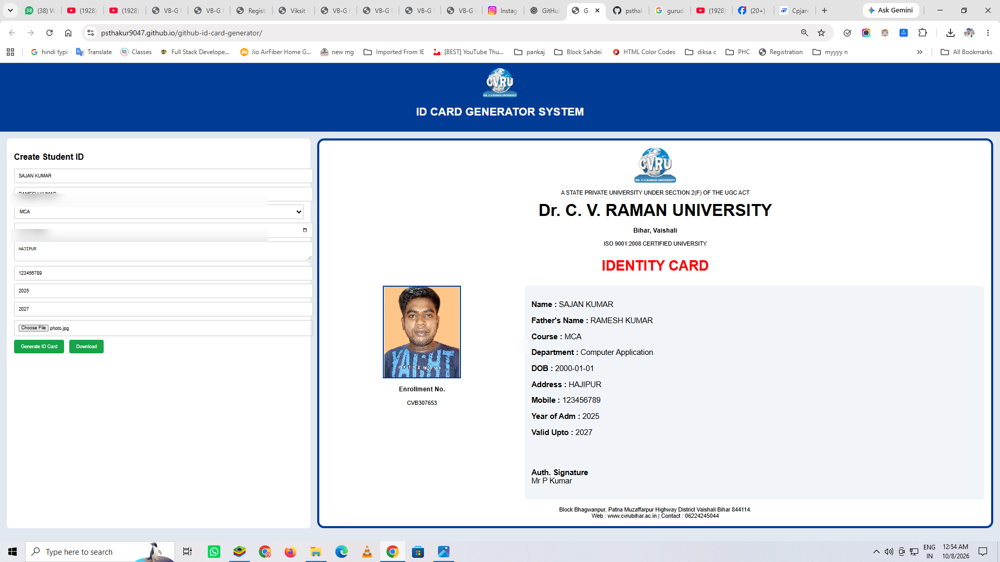

## 📸 Project Preview



---

## ✨ Features
# 🪪 GitHub ID Card Generator

A simple and responsive **Student ID Card Generator** built with HTML, CSS and JavaScript.

The application allows users to enter student information, upload a photo, generate an ID card preview and download the generated ID card as a PNG image.

## 🌐 Live Demo

🚀 Try the project online:

[**Open GitHub ID Card Generator →**](https://psthakur9047.github.io/github-id-card-generator/)

---

## ✨ Features

- 🧑 Student name input
- 👨‍👦 Father's name input
- 🎓 Course selection
- 📅 Date of Birth
- 🏠 Address input
- 📱 Mobile number
- 📚 Year of admission
- 📆 Valid upto date
- 📷 Student photo upload
- 🪪 ID card preview
- 🔢 Automatic enrollment number generation
- 📥 Download ID card as PNG
- 📱 Responsive web layout
- ⚡ Runs directly in the browser

---

## 🛠️ Technologies Used

- HTML5
- CSS3
- JavaScript
- [html2canvas](https://html2canvas.hertzen.com/)

---

## 📋 How It Works

1. Enter the student's details.
2. Select the course.
3. Select the student's date of birth.
4. Enter address, mobile number and admission details.
5. Upload the student's photo.
6. Click **Generate ID Card**.
7. Review the generated ID card.
8. Click **Download** to save the ID card as a PNG image.

---

## 🔢 Enrollment Number

The application automatically generates a random enrollment number using the following format:

```text
CVB + 6 digit number
